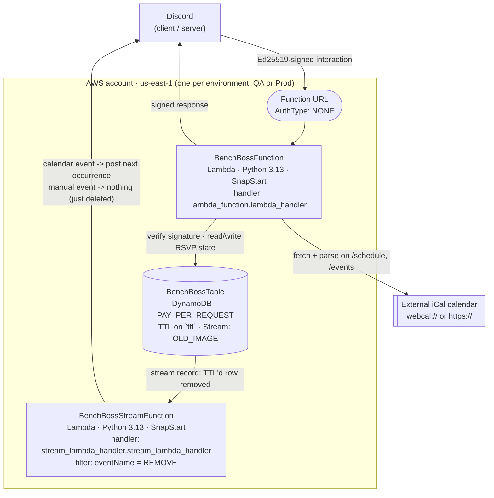
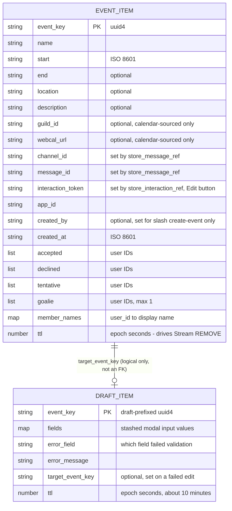
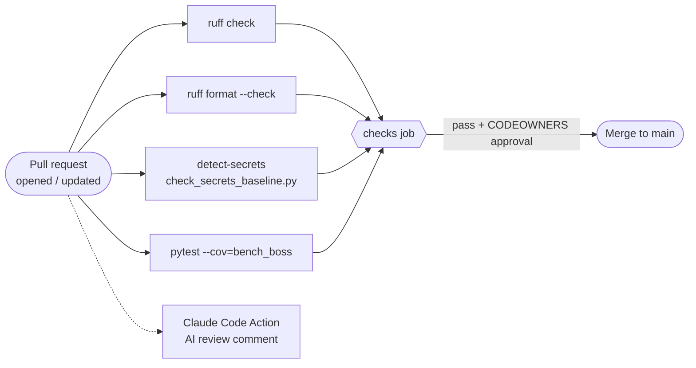

# BenchBoss Infrastructure

High-level design: a serverless Discord bot on AWS. Two SnapStart Lambdas,
one DynamoDB table, and an eight-stage CodePipeline that promotes every
commit on `main` through QA before a human approves Prod.

| | |
|---|---|
| **Region** | us-east-1 |
| **Account model** | single AWS account, stack-isolated (QA and Prod are separate CloudFormation stacks) |
| **Repo** | marcmaniscalco/BenchBoss |
| **Source of truth** | `infrastructure/template.yaml`, `infrastructure/pipeline.yaml` |

For the same content with rendered diagrams and a styled layout, see the
published doc (link kept up to date by whoever last regenerated it — ask in
the repo if you need it).

---

## Overview

BenchBoss is a Python Discord bot that tracks RSVPs for recurring events. It
runs as two AWS Lambda functions — one behind a public Function URL that
handles every slash command, button, and modal submission; the other
triggered by DynamoDB Streams to repost the next calendar event when a
TTL'd row expires. There is no VPC, no load balancer, no container, and no
server to patch. Both functions use **SnapStart** so the published `live`
alias restores from a cached snapshot in ~200–400ms instead of a cold start.

QA and Prod are separate CloudFormation stacks in the *same* AWS account —
isolation is at the stack/resource level, not the account level. A single
CodePipeline stack owns the promotion path between them.

| | |
|---|---|
| Compute | 2× Lambda (SnapStart) |
| Runtime | Python 3.13 |
| Data store | DynamoDB · 1 table |
| Networking | none (no VPC / ALB / NAT) |
| IaC | SAM + CloudFormation |
| Pipeline stages | 8 |

---

## Runtime Architecture

Request path, storage, and the async repost loop — one environment (QA or
Prod); the other is an identical stack.

Both functions share one DynamoDB table and one IAM execution role pattern
(`DynamoDBCrudPolicy` scoped to `BenchBossTable`). Neither has a VPC
attachment.

**Why SnapStart changes the operating model:** SnapStart snapshots each
function's execution environment *after* module-level init code runs, then
restores that frozen snapshot on future cold starts instead of re-running
init. That's fast, but anything read into a module-level variable is frozen
into every restored copy until the next deploy — both handlers register an
`_after_restore` hook specifically to re-run logic that must not be frozen
(currently just resetting `boto3.DEFAULT_SESSION`).

---

## Component Breakdown

### `bench_boss/` — shared package, imported by both handlers

| Module | Responsibility |
|---|---|
| `bot.py` | Core logic — Ed25519 signature verification, `handle_interaction()` command/button/modal routing, Filltime role marking |
| `calendar.py` | `WebCalReader` — fetches and parses external iCal calendars for `/schedule` and `/events` |
| `discord_api.py` | Builds embeds and message components (buttons, selects); `build_help_embed` for `/bb-help` |
| `dynamo.py` | DynamoDB persistence — RSVP state, TTL writes, short-lived modal-retry stash items |
| `stream_handler.py` | Processes DynamoDB Stream `REMOVE` records — repost vs. silent delete |
| `constants.py` | Shared constants — `TEAM_TIMEZONE`, Filltime role ID |

### Entry points & tooling — repo root

| File | Runs where | Purpose |
|---|---|---|
| `lambda_function.py` | Interactions Lambda | Function URL entry point |
| `stream_lambda_handler.py` | Stream Lambda | DynamoDB Streams entry point |
| `register_commands.py` | Local / one-off | Registers slash commands with Discord (prod or QA app) |
| `cleanup_lambda_versions.py` | CodeBuild (Cleanup stages) + manual | Deletes every Lambda version except the one `live` points to |
| `check_secrets_baseline.py` | CodeBuild (Build stage) + GitHub Actions | Re-runs the `detect-secrets` baseline check without git — CodeBuild's source is a zip snapshot with no `.git` dir |

> **Open TODO:** these three tooling scripts currently sit alongside the two
> real handlers at the repo root, which makes it hard to tell "Lambda
> handler" from "build-time tool" at a glance. Tracked in `TODO.md` to move
> into a `scripts/` directory — not yet done.

---

## Data Model

One physical DynamoDB table, two logical item shapes — disambiguated by an
`event_key` prefix, never modeled as separate tables.

Both shapes live in the same `BenchBossTable` (`PAY_PER_REQUEST`, partition
key `event_key`, TTL on `ttl`, stream view `OLD_IMAGE`). A bare `event_key`
(a UUID4) is a real event; a `draft:`-prefixed key is a short-lived "Fix and
Retry" stash for a failed `/create-event` or Edit-button modal submission,
namespaced so its random key can never collide with a real event's.

**Why one table instead of two:** both item shapes only ever need a point
lookup by `event_key` (`get_item` / `put_item` / `delete_item`) — no query
pattern here benefits from a second table or a GSI. Sharing one table also
means both share the same TTL attribute and the same DynamoDB Stream, so
the `REMOVE` filter in `infrastructure/template.yaml` fires for expired
real events and expired drafts alike — `stream_handler.py` is what decides
which of those actually gets a Discord repost.

---

## Environments

Two CloudFormation stacks from the same `infrastructure/template.yaml`, one
AWS account.

| Environment | Stack name | Discord app | Credential secret | `TestPublicKey` | Reached by |
|---|---|---|---|---|---|
| QA | `bench-boss-qa` | Dedicated QA app | `bench-boss/qa` | set — accepts the test-signing keypair too | every push to `main` |
| Prod | `bench-boss-prod` | Production app | `bench-boss/prod` | blank — real signature only | manual approval only |

A personal **sandbox** stack (any name, `make deploy STACK_NAME=...`) is a
third, fully independent option for contributors — same template, deployed
straight from a laptop via SAM, with no connection to QA or Prod and no
pipeline involvement.

---

## CI/CD Pipeline

Two independent gates: a GitHub Actions check that runs on every PR, and a
CodePipeline that runs on every merge to `main`.

### PR gate — GitHub Actions (no AWS involved)

Branch protection requires the `checks` job to pass and a CODEOWNERS
approval. The Claude Code Action review runs in parallel and comments on
the PR — it doesn't gate the merge.

### Release pipeline — AWS CodePipeline (`bench-boss-pipeline` stack)

```mermaid
flowchart LR
  GH[("GitHub\nmain branch")]
  Source["Source\nCodeStarSourceConnection"]
  Build["Build\nlint · pytest · sam build/package"]
  DeployQA["DeployQA\nCloudFormation -> bench-boss-qa"]
  CleanupQA["CleanupQA\nprune Lambda versions"]
  ITest{{"IntegrationTest\nsign + POST -> QA Function URL"}}
  Approve{{"ApproveProd\nmanual gate"}}
  DeployProd["DeployProd\nCloudFormation -> bench-boss-prod"]
  CleanupProd["CleanupProd\nprune Lambda versions"]

  GH -- "webhook via\nCodeConnections" --> Source --> Build --> DeployQA --> CleanupQA --> ITest --> Approve --> DeployProd --> CleanupProd

  classDef build fill:#6b7280,color:#ffffff,stroke:#4b5563;
  classDef deploy fill:#2b6cb0,color:#ffffff,stroke:#1e4e80;
  classDef gate fill:#d9711f,color:#ffffff,stroke:#a85a1d;
  class Source,Build,CleanupQA,CleanupProd build;
  class DeployQA,DeployProd deploy;
  class ITest,Approve gate;
```

Orange = human or live-endpoint gate · blue = stack deploy · grey =
build/cleanup. A failed **IntegrationTest** stops the pipeline before
**ApproveProd** is even reachable.

| Stage | Action provider | What happens |
|---|---|---|
| Source | CodeStarSourceConnection | Pulls `marcmaniscalco/BenchBoss@main` via a GitHub App connection; webhook triggers on every push |
| Build | CodeBuild (`buildspec.yml`) | `ruff check`, `ruff format --check`, secrets scan, `pytest --cov`, `sam build` / `sam package` → `packaged.yaml` |
| DeployQA | CloudFormation (CREATE_UPDATE) | Applies `packaged.yaml` as `bench-boss-qa`; credentials resolved inline via `{{resolve:secretsmanager:...}}` — publishes a new SnapStart Lambda version on every code change, which is why CleanupQA runs right after (see [Cost](#cost)) |
| CleanupQA | CodeBuild (`cleanup-buildspec.yml`) | Deletes every Lambda version in `bench-boss-qa` except the one `live` points to — runs after every deploy because SnapStart bills to cache *every* version ever published, not just the current one (see [Cost](#cost)) |
| IntegrationTest | CodeBuild (`integration-buildspec.yml`) | Signs real interaction payloads with the QA-only test keypair — accepted only because QA's `TestPublicKey` is set (see [Environments](#environments)) — POSTs to the live QA Function URL, asserts on responses |
| ApproveProd | Manual approval | A human clicks Approve/Reject in the console after checking QA |
| DeployProd | CloudFormation (CREATE_UPDATE) | Applies the same template as `bench-boss-prod` — same reason, publishes a new SnapStart version, which is why CleanupProd runs right after (see [Cost](#cost)) |
| CleanupProd | CodeBuild (shared cleanup project) | Same version pruning, targeting `bench-boss-prod` — same SnapStart cache-cost reason as CleanupQA (see [Cost](#cost)) |

> **Why `PipelineType: V2` + `ExecutionMode: QUEUED`:** ApproveProd is a
> manual gate that can sit unapproved for days. Under V1's default
> `SUPERSEDED` mode, a newer push doesn't preempt an execution already
> parked at that gate — every commit landing in the meantime just collapses
> into one "next in line" execution, and approving a stale gate deploys
> whatever was sitting there, not necessarily the latest commit. `QUEUED`
> processes executions FIFO, one fully at a time, so what gets approved is
> always exactly the commit shown.

---

## Secrets & IAM

Credential isolation is deliberate: the integration test role can never
read the real Discord bot token.

### Secrets Manager

| Secret | Shape | Read by |
|---|---|---|
| `bench-boss/qa` | `DiscordPublicKey`, `DiscordToken` | CodePipeline, resolved directly into DeployQA's `ParameterOverrides` |
| `bench-boss/prod` | `DiscordPublicKey`, `DiscordToken` | CodePipeline, resolved directly into DeployProd's `ParameterOverrides` |
| `bench-boss/qa-test-signing-key` | `TestPublicKey`, `TestSigningPrivateKey` | `TestPublicKey` → DeployQA parameter · `TestSigningPrivateKey` → only the IntegrationTest CodeBuild role, at build time |

### IAM roles (defined in `pipeline.yaml`)

| Role | Used by | Scope |
|---|---|---|
| `BuildRole` | Build project | CloudWatch Logs + artifact bucket only |
| `IntegrationTestRole` | IntegrationTest project | Logs + artifact bucket + `secretsmanager:GetSecretValue` scoped to `qa-test-signing-key` only |
| `CleanupRole` | Cleanup project (shared QA + Prod) | Logs, artifact bucket, `DescribeStackResources`, `ListVersionsByFunction`/`GetAlias`, and `DeleteFunction` scoped to qualified ARNs only (`function-*:*`) — can prune versions, can't delete a whole function |
| `CloudFormationRole` | DeployQA / DeployProd | `AdministratorAccess` — broad by design, since SAM provisions IAM roles, Lambda, DynamoDB, event source mappings, and Function URLs on each deploy |
| `PipelineRole` | CodePipeline itself | Orchestration only: artifact bucket, `codestar-connections:UseConnection`, `StartBuild`/`BatchGetBuilds` on the three CodeBuild projects, stack actions, `PassRole` to `CloudFormationRole` |

---

## Known Issues

Documented in `TODO.md` — real, unresolved, and worth knowing before
touching the pipeline.

> **Discord tokens are visible in plaintext via pipeline execution history**
>
> **Where:** `pipeline.yaml` — the DeployQA and DeployProd actions resolve
> `{{resolve:secretsmanager:...}}` directly inside `ParameterOverrides`.
>
> **Impact:** anyone with CodePipeline read access can see the resolved
> `DiscordToken` / `DiscordPublicKey` in plaintext via `ListActionExecutions`
> or `GetPipelineExecution` — CloudFormation resolves the reference, but the
> pipeline's own execution history still records the substituted value.
>
> **Planned fix:** stop passing the secret through `ParameterOverrides`
> entirely; fetch it from Secrets Manager at runtime inside the Lambda's
> `_after_restore` hook instead of a module-level env var read (module scope
> would freeze a rotated secret into every SnapStart-restored copy until the
> next deploy). Full design is written out in `TODO.md`. **Not started.**

---

## Cost

Pay-per-request compute and storage keep this cheap — with one specific
gotcha.

**Application stack (per environment):** a few cents a month at low
traffic — Lambda and DynamoDB are both pay-per-request with generous free
tiers, and there's no ALB, VPC, or NAT gateway to pay for regardless of
volume.

**Pipeline:** roughly $2–3/month at low commit volume — CodePipeline's flat
fee, a handful of CodeBuild minutes, and three Secrets Manager secrets. The
GitHub CodeConnections webhook itself is free.

> **The SnapStart gotcha the Cleanup stages exist for:** both functions use
> `AutoPublishAlias: live` + SnapStart. AWS bills `Lambda-SnapStart-Cached-GB-S`
> to keep a snapshot cached for **every version that's ever had SnapStart
> applied** — not just the current one — for as long as that version
> exists. Nothing in SAM prunes old versions automatically. A week of
> frequent QA deploys once ran both `bench-boss-qa` functions up to 33
> versions each (66 total), costing roughly **$4.50/day** in pure
> cache-storage charges for versions nothing was invoking. **CleanupQA** and
> **CleanupProd** exist specifically to keep this from recurring — they run
> `cleanup_lambda_versions.py` after every deploy, deleting everything
> except the version the `live` alias currently points to.

---

*Generated from `infrastructure/template.yaml`, `infrastructure/pipeline.yaml`,
`README.md`, and `TODO.md` at the current state of `main`. Keep this in
sync when those files change.*
